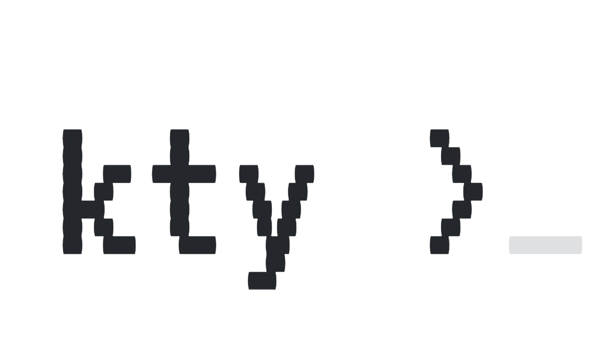

<picture>
  <source media="(prefers-color-scheme: dark)" srcset="./docs/public/logo-dark-github.gif">
  
</picture>

The terminal for Kubernetes. kty is the easiest way to access resources such as
pods on your cluster - all without `kubectl`. Once kty is installed on your
cluster, `ssh` gives you a dashboard to interact with the cluster.

You can:

- Use your GitHub or Google account to log into the cluster. No more annoying
  `kubectl` auth plugins.
- Get a shell running in pods - just like you would when SSH'n into a host
  normally.
- Access the logs for running and exited containers in a pod.
- Forward traffic from your local machine into the cluster or from the cluster
  to your local machine.
- `scp` or `sftp` files from pods.
- Access the cluster from any device that has an SSH client, from phones to
  embedded devices.

kty is an SSH server written in rust which provides a TUI-based dashboard that
maps Kubernetes concepts to SSH. It relies on OpenID providers such as GitHub or
Google to verify your identity. Kubernetes RBAC validates access, just like
`kubectl` does, respecting your organizational policies.

Visit the [docs](https://kty.dev) to get started!

## Releases

- See releases for the latest tagged release.
- The `unstable` tag is updated on every merge to main.
