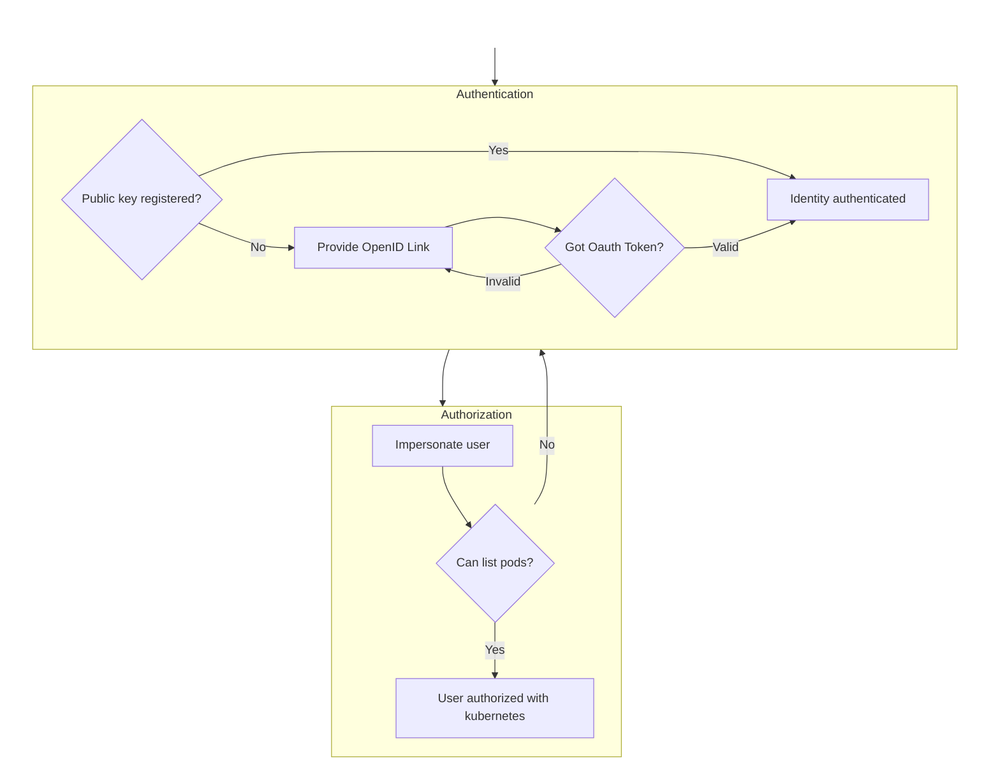

# Access Control

kty utilizes external systems for both authn and authz. To fetch your identity,
a combo of OpenID and the `keys` resource in your cluster are used. These map
from something external (an oauth identity token or a public key hash) to a
`User` and `Group` inside of k8s.

Similar to authentication, kty does not do authorization itself. Instead, it
[impersonates][impersonate] the authenticated user. Any action that is taken
from that point forward uses the users' permissions as granted via. RBAC in k8s.

[impersonate]:
  https://kubernetes.io/docs/reference/access-authn-authz/authentication/#user-impersonation

## Flow



## Authentication

There are two ways for an incoming SSH session to get a user identity:

- OpenID - If the user does not have an authorized public key, the SSH session
  prompts with an open id flow. When that flow is successful, the returned token
  is mapped to a k8s identity. By default, this is the `email` claim in the
  identity token. If you would like to map different claims and/or add groups,
  take a look at the server configuration.
- Public Key - By default, once a user has been authenticated with openid, they
  will have a public key. This will contain the user and group information
  extracted from the identity token. If you would like to skip OpenID entirely,
  you can create `Key` resources, the `kty users key` can be used to do this as
  an alternative to `kubectl`.

To validate that a user has access, you can use the `kty users check` command.
This is a great way to debug why users are not being allowed to connect.

```bash
kty users check foo@bar.com
```

## Authorization

To be authorized, either the name or groups for a user need to have role
bindings added to the cluster. The `kty users grant` command is one way to go
about this, but it is purposely naive. To do something more flexible, you can
check out `kubectl`:

```bash
kubectl create clusterrolebinding foo-bar-com --clusterrole=<my-role> --user=foo@bar.com
```

Note that you can use a `RoleBinding` instead, but only for specific
functionality.

### SSH

The minimum permissions are:

```yaml
resources: ['pods']
verbs: ['list', 'watch']
```

To see logs:

```yaml
resources: ['"pods/log']
verbs: ['get']
```

To get a shell:

```yaml
resources: ['pods/exec']
verbs: ['create']
```

Note: without the full permissions it is possible that the dashboard has some
issues rendering.

### Ingress Tunnel (`ssh -L`)

For each supported resource type (nodes, services, pods), you need:

- `create` for `resource/proxy`
- `get` for `resource`

Notes:

- `resourceNames` works for these but it is a little unwieldy for names that are
  auto-generated such as `node` and `pod`.
- For namespaced resources (`services`, `pods`), this can be a `RoleBinding`.

Here's an example role for `pods`:

```yaml
apiVersion: rbac.authorization.k8s.io/v1
kind: ClusterRole
metadata:
  name: my-role
rules:
  - apiGroups: ['']
    resources:
      - pods/proxy
    verbs:
      - create
    # resourceNames:
    #   - my-statefulset-0
  - apiGroups: ['']
    resources:
      - pods
    verbs:
      - get
```

### Egress Tunnel (`ssh -L`)

The minimum permissions are:

```yaml
resources: ['services', 'endpointslices']
verbs: ['patch']
```

### SFTP(SCP)

To support `scp`, the minimum permissions are:

```yaml
apiVersion: rbac.authorization.k8s.io/v1
kind: ClusterRole
metadata:
  name: my-role
rules:
  - apiGroups: ['']
    resources:
      - pods/exec
    verbs:
      - create
  - apiGroups: ['']
    resources:
      - pods
    verbs:
      - get
```

This will allow fetching files directly in addition to listing files that are
pod specific (eg `/<namespace>/<pod>/<container>`).

To list files at the cluster level, you'll need to add:

```yaml
apiVersion: rbac.authorization.k8s.io/v1
kind: ClusterRole
metadata:
  name: my-role
rules:
  - apiGroups: ['']
    resources:
      - pods
      - namespaces
    verbs:
      - get
      - list
```
